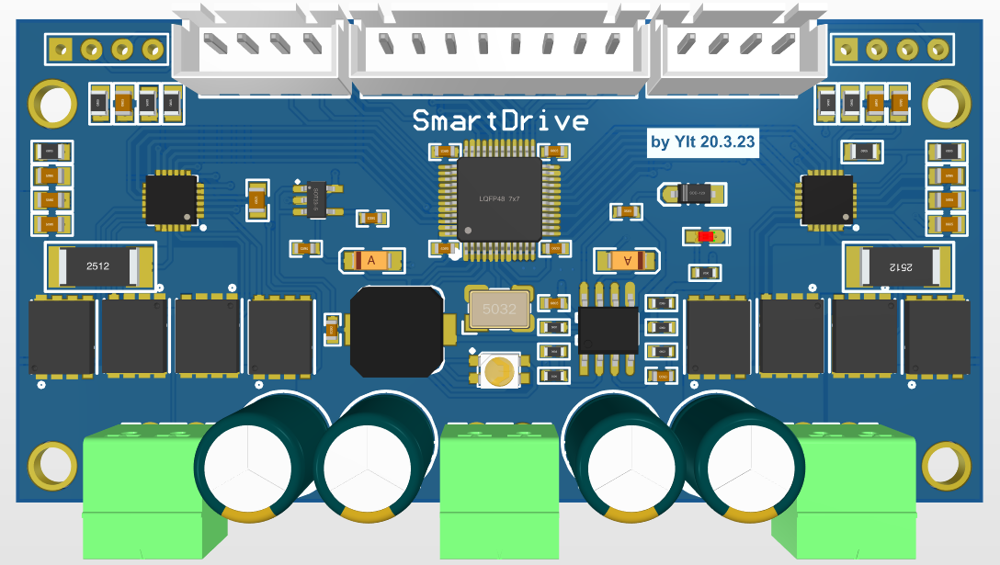
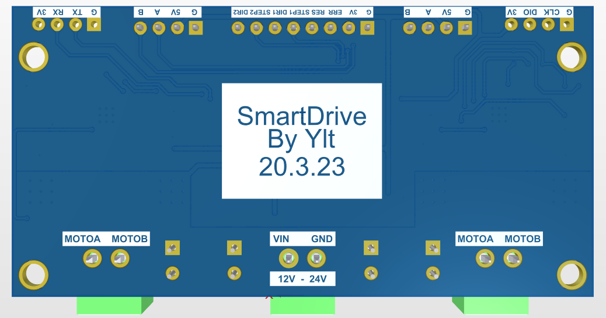

# SmartDrive
SmartDrive（智驱）的开源仓库

SmartDrive（智驱）是一系列驱动器的集合，分别包含BDCM（直流有刷电机）、BDCM2（直流有刷电机双路）、BDCM-LITE（直流有刷电机轻版）、DigitalServo（数字总线舵机）、STEPPER（步进电机）、BLDC（直流无刷电机）。

> 该驱动器由 YLT 制作，并开源，遵循GPL协议，仅可用于非商业用途，商用请联系773673787@qq.com

# 一 SmartDrive_BDCM2

智驱的双路直流有刷电机版本，该版本可以驱动两个直流有刷电机，带有位置环、速度环、电流环，提供高性能伺服。

BDCM2版本可以提供单路 最高36V、持续10A 的大电流输出。兼容两种通信方式，分别是 STEP/DIR ，兼容一般的步进电机，私服系统。USART（串口）115200通信速率，遵循私有协议，发送位置、速度指令进行控制，连接上位机可进行调参。

# 二 SmartDrive_DS

智驱的数字总线舵机版本，该版本可以挂载兼容DYNAMIC、博创系列总线舵机的协议，使用stm32f030c8t6，支持5-16v输入

# 三 SmartDrive_Stepper

智驱的步进电机版本，支持12v max 输入，STEP/DIR 信号输入

